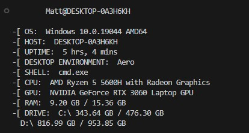

# dynxfetch
dynxfetch is a quick, simple and portable system info fetcher written in python. the goal was to write a robust program requiring little to none external dependencies. currently, it supports Linux and Windows, with theoretical support of macOS (which, as of yet, hasn't been tested).

## requirements
in it's current state, there's two external dependencies, `cpuinfo` and `psutil`. in the future, there's plans of reducing the need of these to zero, but as of now, they are required.

## usage
clone the project `git clone https://github.com/mattnotdev/dynxfetch`

enter the folder containing `dynxfetch.py`

run the script in a terminal, using your chosen python environment, ex. `python dynxfetch.py`

## plans for the future
as of now, the project isn't being actively developed, although if i were to return to the thing, it'd be nice to:

- add customisation options,

- add colouring,

- add the ability to render a ASCII logo besides the fetched information,

- reduce the dependency count to zero.

